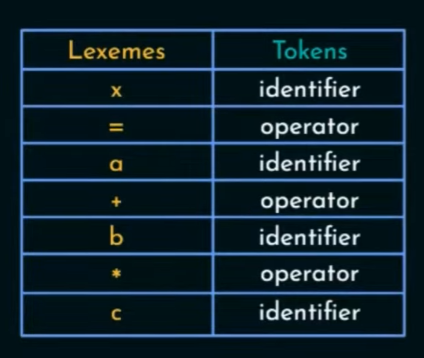

# Project description
- make a compiler


# Steps

1. Handle params
2. Open file
3. Read symbols
4. Lexical analyzator
    - make tokens
    - every "word" is a token
    - probably analyze line by line
    - each line corresponds to stream of 
    - 

    ```c
    @param str
    table = LA.init_table();
    token = LA.get_token();
    i = 0;
    while(token != ';')
        token = LA.get_token(str, i); // updates i value 
        LA.add_token_to_arr(token);

    // free memory and cleanup
    return LA.get_arr();
    ```
5. Syntax analyzer
    - updown or downup?
    - check basic rules like... after keyword `var` u cant have `=` symbol
    - create a parse tree and check if code follow it... then passes it formard
    - 

    ```c
    void build_tree(tree, arr) {
        const rules;

        // fill tree with validation according to rules
    
    }

    @param arr_of_tokens
    tree = SynA.init_tree();
    SynA.build_tree(tree, arr_of_tokens) 

    // free arr and other further obsolete memory

    ```
6. Semantic analyzer 
    - check if variable is defined before assigning
    - type missmatch checking, scope
    - verifies the tree
    - validates the tree and passes it further

    ```c
    @param tree
    semA.validate(tree)

    // free mem
    ```
7. intermediate code gen
8. (Optional) optimizer
9. Generate code
 
# Additional

- Error handler
